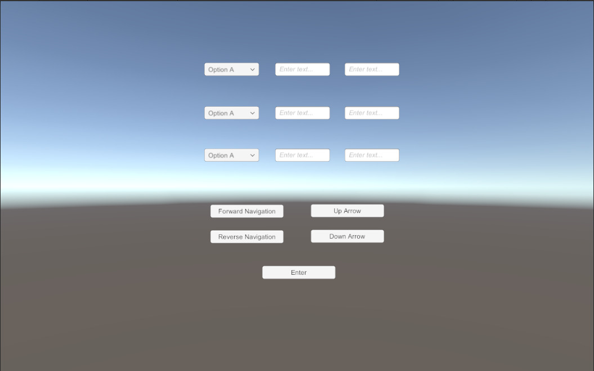

# Tab-Navigation
Sample Unity application demonstrating how to navigate text boxes and drop downs using buttons

## Screenshot

## To use Tab Navigation:

- Go to [EasyTab Unity package release page](https://github.com/dav-sea/EasyTab/releases). Download the Unity Package file. e.g EasyTab-1.3.1.unitypackage
- Import the Unity Package file. (right click Assets. import package -> custom package)
- Create Scripts folder and import the files: CustomDropdown, DownArrow, Enter, ForwardNavigation, ReverseNavigation and UpArrow
- Set input field that should have focus at the start. This can be done by clicking on EventSystem and then dragging the input field over the "First Selected" property
- Attach EasyTab script to all navigation buttons. Set "Selectable Recognition" property to "As not selectable"
- Attach the imported scripts to the navigation buttons
- Create text boxes and drop downs in scene tab
- Attach CustomDropdown.cs script to all the drop downs in the scene
- Set the selectable color of each text box and drop down from the properties inspector
- The next and previous Selectable can be configured for each text box and drop down. To configure the next and previous Selectable, Attach EasyTab script to the drop down or text box. Set the Jumping Policy to "Use only jumping" and then drag the drop down or text box to the Next Jump and Reverse Jump fields